# Deep Stone Crypt - Technical Guide

An opinionated guide on best practices for experienced teams, and for carrying/teaching, in the Deep Stone Crypt.

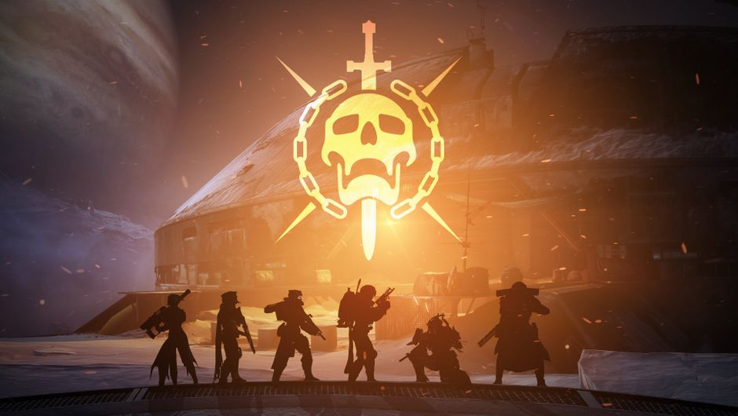

## Contents

- [:book: Foreword](#foreword)
- [:briefcase: Loot Table](#loot-table)
- [:placard: Encounters](#encounters)
  - [:information_source: Overview](#overview)
  - [:penguin: Sparrows](#sparrows)
  - [:unlock: Security](#security)
  - [:person_fencing: Atraks](#atraks)
  - [:climbing_woman: Parkour](#parkour)
  - [:volleyball: Rapture](#rapture)
  - [:man_in_motorized_wheelchair: Taniks](#taniks)
- [:vhs: Secrets](#secrets)
- [:bookmark_tabs: Side-Effects](#side-effects)
- [Credits](#credits)

## Foreword

This is meant to be an absolute technical guide to the Deep Stone Crypt, not an exploration of the lore. It is meant for players who want to understand in depth how the encounters work and best practices and callouts. You should have completed it several times and be interested in teaching it for this to be useful to you. This is not designed to be a beginner guide. In order to complete all of the actions described in this guide you must be reasonably competent and efficient enough not to be overwhelmed by adds.

**Sidenote**: I have ADHD so it is very likely that I will not complete this fully. I'm very open to improvements so if you want to add something please make a PR and I'll try and have a look.

## Loot Table

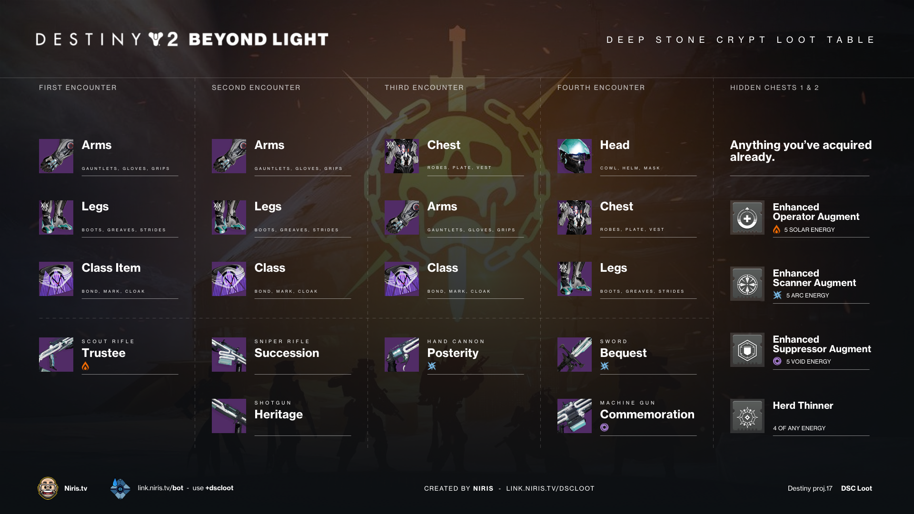

## Encounters

| **In-Game**       | **Colloquial** | **Guide** | | :information_source: |
|-------------------|----------------|---|-------------------|----------|
| `DESOLATION`      | Sparrows       | Sparrows | [link](#sparrows) | :penguin: |
| `RESTRICTED`      | Security       | Security | [link](#security) | :unlock: |
| `CLARITY CONTROL` | Atraks         | Atraks | [link](#atraks)   | :person_fencing: |
| `DESCENT`         | Parkour        | Parkour | [link](#parkour)  | :climbing_woman: |
| `RAPTURE`         | Taniks 1       | Rapture | [link](#rapture)  | :volleyball: |
| `RESTRICTED`      | Final Boss    | Taniks | [link](#taniks)   | :man_in_motorized_wheelchair: |

### Overview

#### Buffs (nom. Augments)

| Name       | Colour | :information_source: | Basic Description   |
|------------|--------|---|---------------------|
| Scanner    | Yellow | :yellow_square: | `SEES` things       |
| Operator   | Red | :red_square:    | `DOES` things       |
| Supressor* | Blue | :blue_square:   | `STUNS` Taniks      |

\* The :blue_square: Supressor buff only appears in [Rapture](#rapture) and [Taniks](#taniks).

#### Things to bring

**Note**: The weapons that need bringing are influenced by seasonal mods

| Image | Description |
|---|---|
| 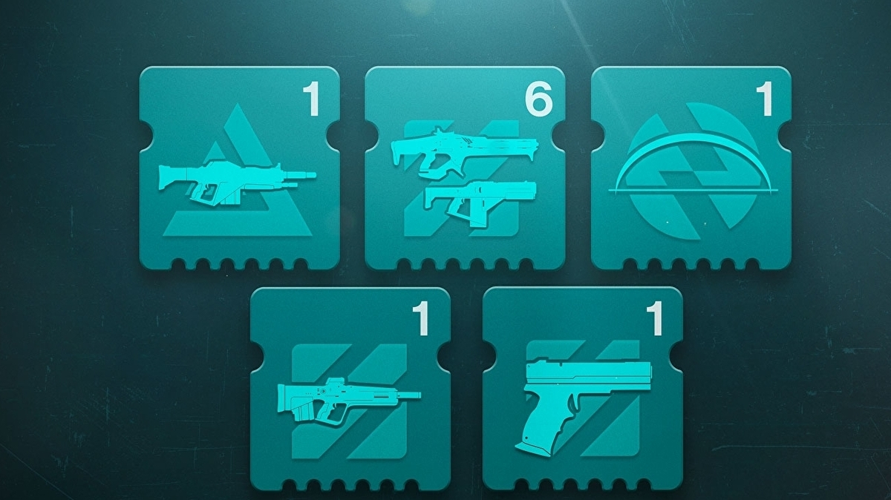 | **Overload**: Security and Rapture contain overload captains, so the correct related seasonal mode is required to deal with them. Replace the loadout's kinetic shotgun with whatever is needed. |
| 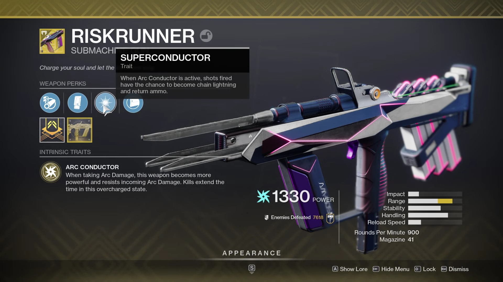 | **Riskrunner**: The main weapon you need to be bringing is Riskrunner. It is an Arc SMG that provides Arc resistance and deals chain lightning after being hit by Arc damage. Most damage in the first two encounters and the parkour section is Arc damage, so it procs near-constantly. |
| 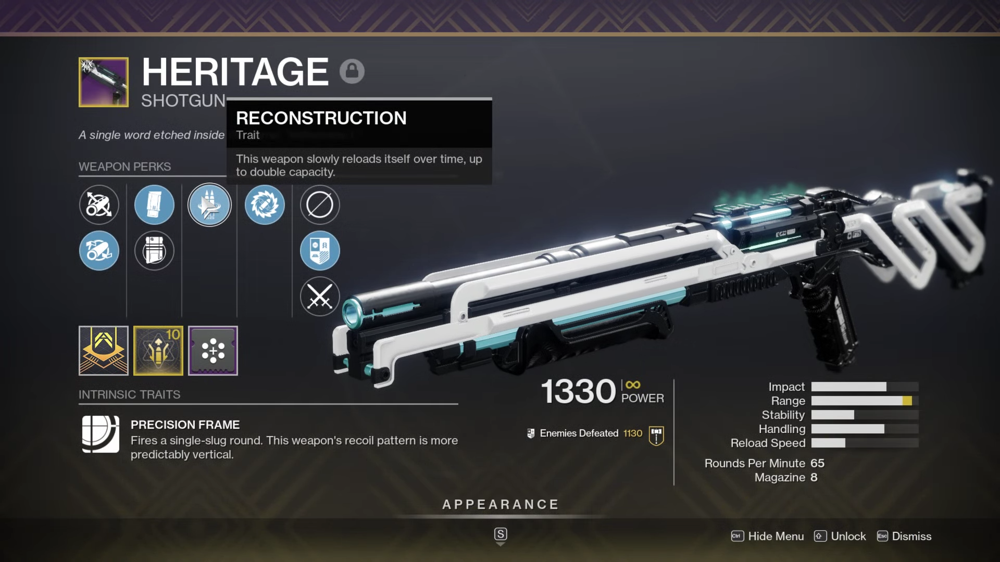 | **Kinetic Shotgun**: Throughout all the encounters having a kinetic shotgun will be necessary. Ideally, it is a slug shotgun - the trait `Precision Frame`. But know that not all `Precision Frame` shotguns are slug shotguns. Use this shotgun for killing adds, or for boss DPS if there is not an overriding meta - like `One Thousand Voices` in season 15. It is also used to supress the boss in the boss encounter. |
| 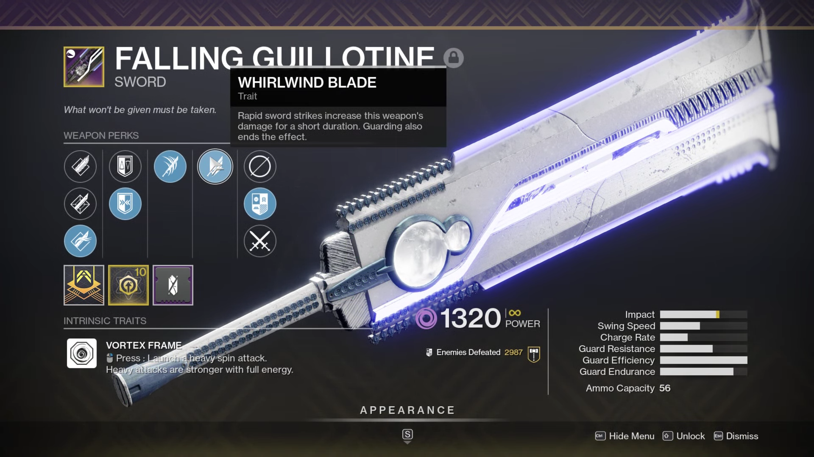 | **Void Sword**: An elementally void sword is a must-have item, as the only combatant shields present are void, and the best swords are void. Pictured here is `Falling Guillotine` with the trait `Whirlwind Blade`. This deals the highest DPS across all swords. An alternative for titans is `Crown-Splitter`. |
| 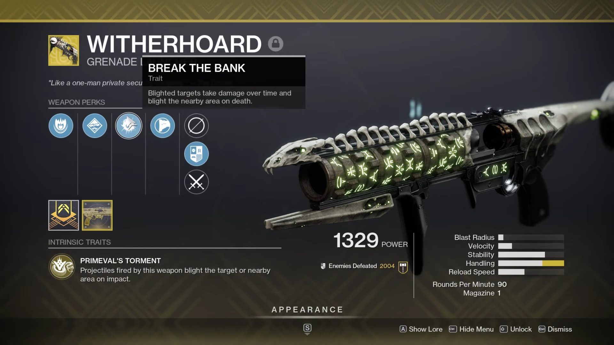 | **Witherhoard** (Optional): In the third encounter, witherhoard is useful specifically for the :blue_square: Supressor augment, along with add-clear. Hit Taniks with a single witherhoard and run all three nodes without shooting him again and he will be supressed. Hits next to him won't work as well, and must be supplemented by other weapon hits. |

### Sparrows

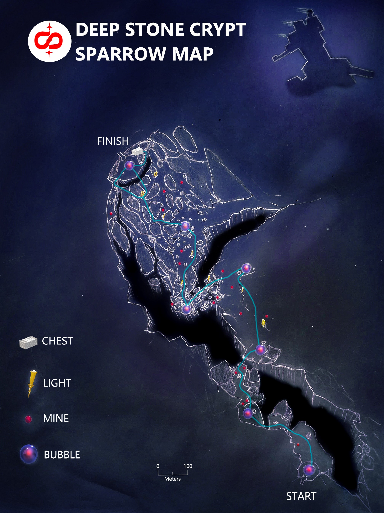

#### :information_source: Outline

The sparrow puzzle consists of a set of bubbles of safety from the everpresent storm that will kill you if you stay out in it. You have ~10 seconds to move between bubbles. Upon reaching each bubble you should kill all the adds, or, if they are already defeated, jump off and re-summon your sparrow anyway. This sets your respawn point to the new bubble in case you don't make it to the next.

Unless you plan on getting the Retrocausality sparrow, don't touch the pikes as their horsepower is only 150, and you won't need their guns.

The secret chest is located to the right of the final bubble, up the cliff.

#### :guard: Gear
|  |  |
|---|---|
| 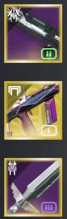 | The recommended loadout for this encounter is meant for serious add control. The sword must be void for this to work as intended. |

#### :calendar: Challenge

To earn the Retrocausality exotic sparrow, all the pikes found at the beginning must be brought to the last bubble. Six players - who have each mounted a pike at least once - are required.

The easiest way of guaranteeing that the sparrow will be earned is to take all the pikes to the final bubble and have all fireteam members mount one at that point.

---

### Security

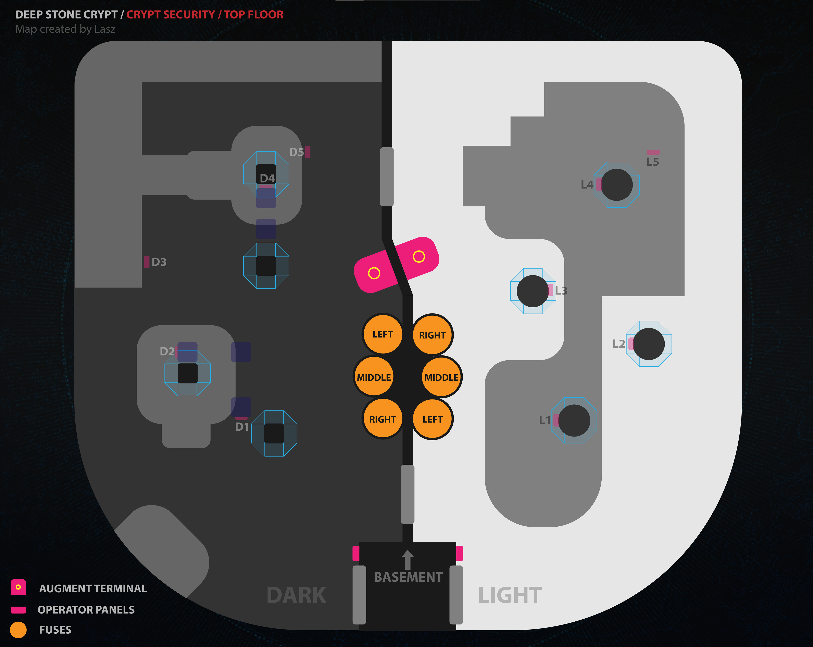
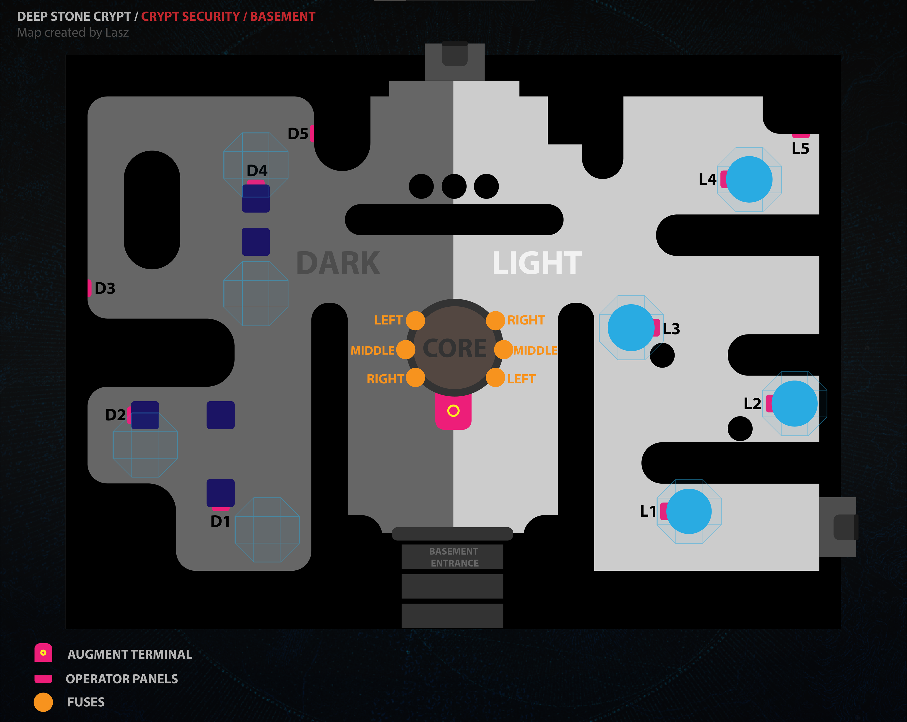

#### :information_source: Outline

Security is divided into three distinct rooms: :white_circle: Light, :black_circle: Dark, and :small_red_triangle_down: Basement. In each room there is an augment terminal, where an augment buff may be uploaded or downloaded. An uploaded buff is available in every terminal, not just the one in which it was deposited.

To start the encounter, the :red_square: Operator buff is acquired by a player.

##### :purple_circle: Servitors

At all points, teams must kill :purple_circle: Servitors as quickly as possible, as their presence prevents the action of the augment terminals.

##### First Phase

See Scanner's :yellow_square: **Panel Callouts** and :yellow_square:+:red_square: **Opening the fuses (1)** in both. When the fuses open an alarm will sound. At this point a third player is required. This is described in :yellow_square:+:red_square: **Changeover**.

After the swap has occurred, the player in the basement must scan the three small fuses located around the central column into which the augment terminal is embedded. They call out which fuse requires damaging. See :yellow_square: **Fuse Callouts**. 

##### Damage Phase

All players upstairs must be damaging the correct fuse using their heavy weapons. If an incorrect fuse (or no fuses) are shot, the team will wipe.

Below each fuse there are a set of lights, that progress from left to right. These show time progression through any stage. During main stage they show the time elapsed in the encounter; if they fill the team wipes. During damage phase they progress much more rapidly and show how long is left to damage the fuses. Three chances are given to DPS the fuses before enrage occurs.

##### Rinse and Repeat

Once the fuses close, the new operator must save the scanner from the :small_red_triangle_down: Basement. See :yellow_square:+:red_square: **Opening the fuses (2)**. This starts a new **damage phase**.

#### :guard: Gear
| | |
|---|---|
| 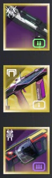 | Use riskrunner to kill adds, then use the heavy grenade launcher to damage the fuses (use shotgun if out of ammo). This increases survivability in all rooms. |

#### :yellow_square: Scanner

The player who intends to be :yellow_square: Scanner must start on the :black_circle: Dark side.

##### Panel Callouts

As shown in the pictures above, the panels each have a number and a side. There are sections of glass floor that allow for a scanner upstairs in :black_circle: Dark or :white_circle: Light to see down into :small_red_triangle_down: Basement. Each panel is located beneath one of these.

There are **5** panels located on each side, **two** of which will be glowing. The numbers are counted from the :red_square: Operator's door and staircase.

##### Opening the fuses (1)

Kill the `Hacker Vandal` on dark side and pick up the :yellow_square: Scanner augment it drops. Read the panels and state your callout clearly. Then run to the :red_square: Operator door at the end of the room, and, when the operator opens the door, run through both doors across to :white_circle: Light side. Scan :white_circle: Light callouts and state them clearly.

##### Changeover

Position yourself next to the augment terminal in the middle of the room and await the alarm side. Once the :red_square: Operator buff has been transferred, put your :yellow_square: Scanner buff into the augment terminal and move to damage phase.

##### Fuse Callouts

Upon recieving the :yellow_square: Scanner augment in the :small_red_triangle_down: Basement, look at the Core immediately behind the augment terminal. There are six small fuses that correspond to the fuses in :black_circle: Dark and :white_circle: Light.

The callout consists of a fuse side and `left`, `middle` (abbrev. `mid`), or `right`. E.g. `Dark Right` or `Light Middle`.

##### Opening the fuses (2)

Damage phase is now finished. The :yellow_square: Scanner now goes to the panels in the :small_red_triangle_down: Basement and reads the full callout of four numbers - stating it clearly for the :red_square: Operator. You then run to the :red_square: Operator door and, when it opens, climb the staircase until reaching the top step, which opens the door in front of you.

You and the :red_square: Operator now swap places - the :red_square: Operator goes down. You must pick which side you want to emerge onto and walk into the door until it opens. It opens due to the :red_square: Operators' shooting the exit panel, however their door only opens when you have left.

Await **Changeover** at the augment terminal.

#### :red_square: Operator

The player who starts as :red_square: Operator should acquire their buff on :white_circle: Light side, to ensure a :white_circle::three:-:black_circle::three: player balance.

##### Shooting the wrong panel

If you shoot the wrong panel, the :small_red_triangle_down: Basement catches fire and you die.

##### Opening the fuses (1)

The :red_square: Operator should acquire their augment from the augment terminal on :white_circle: Light side.

They clear adds until the :yellow_square: Scanner has completed their callout. They then go to the :red_square: Operator door and shoot the associated panel. This opens both doors and allows the scanner to run through to :white_circle: Light. The :red_square: Operator goes down into the :small_red_triangle_down: Basement and shoots the callouts the :yellow_square: Scanner provides.

##### Changeover

When the final panel has been shot, run to the :small_red_triangle_down: Basement augment terminal and put the :red_square: Operator augment in. A non-augmented player picks this up and becomes the new :red_square: Operator. You wait and then acquire the :yellow_square: Scanner augment. See :yellow_square: **Fuse Callouts** for the next step.

##### Opening the fuses (2)

As the new :red_square: Operator, you need to go to the door at the end of the room and shoot the panel, then the panel on the inside. This opens the door at the bottom for the :yellow_square: Scanner. Once they have scanned and given you their callout, they will climb the stairs and be released into your room. You must then go down and shoot the panel at the bottom; This will release them and allow you through into the :small_red_triangle_down: Basement.

You now shoot all the panels, and then perform :red_square: **Changeover**.

#### :calendar: Challenge - `Red Rover`

The challenge for Security is called Red Rover; each player must complete the role of the :red_square: Operator at least once.

Number yourselves in roster order. #1 picks up :red_square: Operator first. Dark side is scanned and they let :yellow_square: Scanner through and shoot those panels. Then they send the buff up and #2 picks it up. #2 rescues them as shown in :red_square: **Opening the fuses (2)**. Damage phase starts and **Changeover** occurs, with #3 acquiring :red_square: Operator.

Two fuses are destroyed, and :yellow_square: Scanner in the :small_red_triangle_down: Basement scans both and the next :red_square: Operator rescues them, then swaps. Rinse and Repeat in roster order until the fuses are destroyed.

If one player fails to operate or picks up the buff twice, the challenge is failed.

---

### Atraks

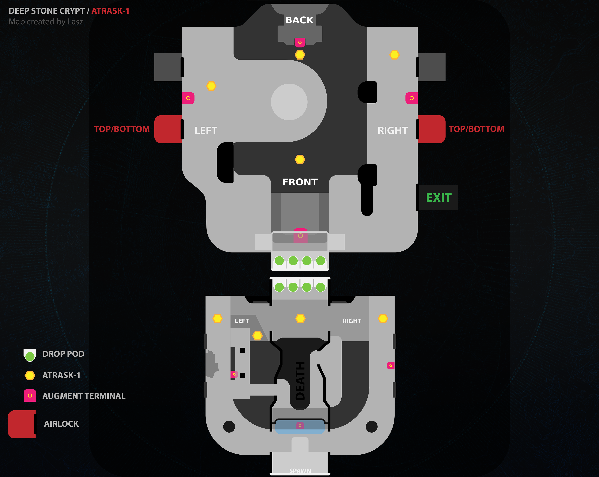

#### :information_source: Outline

| | | |
|---|---|---|
| 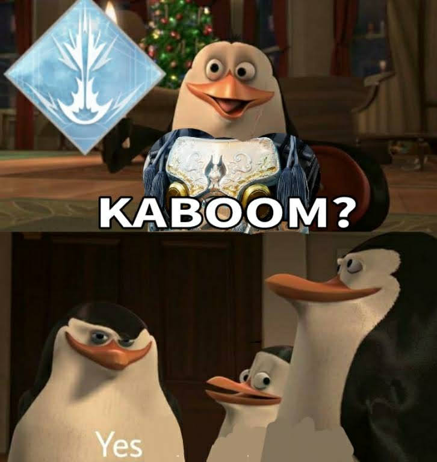 |  | This encounter is focused heavily on boss DPS and time co-ordination. If you have three titans with the `Cuirass Of The Falling Star`, then Atraks is the easiest encounter in the raid. If not, then it is the most challenging. |

There are **eight** bosses in this encouter; you must kill the correct one. The :yellow_square: Scanner sees which boss to attack, and the :red_square: Operator keeps the consequences from killing you.

Two accepted strategies exist, depending on your team members:
- Normal Strat
- Thundercrash Strat - with a minimum of three titans running Thundercrash and wearing the `Cuirass Of The Falling Star`.

##### Method

Read **Structure** and **Elevators**.

##### Components

- :elevator: Elevators
- :world_map: Boss Locations
- :dagger: DPS
- :biohazard: Replications
- :knife: Last Stand

##### Structure

The map is divided into two sections - :arrow_up: upstairs and :arrow_down: downstairs. All players begin :arrow_down: downstairs and use the :elevator: elevators to move between. There are 8 bosses, 4 on each floor. See the encounter maps for their :world_map: locations and callouts.

Six :purple_circle: Servitors appear across the map. The :arrow_up: top right one should be kept alive to trigger damage phase.

##### Elevators

The elevators can be used by anyone by stepping into them and `USE`ing them. The :red_square: Operator augment can interact with them by shooting the panel next to them. This causes them to move :small_red_triangle: up or :small_red_triangle_down: down - as if someone has stepped into them.

##### Boss Locations

See the **Encounter Map** for their locations within the map. The Atraks-s are named from where you enter the room.

###### :arrow_down: Downstairs

| Name | Description |
|---|---|
| Top Left | Yellow side on the upper balcony. |
| Bottom Left | Yellow side on the lower pad. |
| Middle | In front of the elevators. |
| Right | Red side, upper balcony. |

When recieving :yellow_square: Scanner you should stand behind the cover next to the bottom left augment terminal. This lets you see the two left Atraks-s. If neither are glowing then run up the stairs to the middle, where you can now see the final two.

##### DPS

###### Normal Strat

See **Meme 2**

With the normal strat, the :yellow_square: Scanner calls out the location of a boss, and all the players on that floor converge on it. The :yellow_square: Scanner counts down **3**, **2**, **1**, **Go** and everyone attacks with their sword (See **Gear**). The :yellow_square: Scanner then puts their augment into the terminal so the damage can continue.

###### Thundercrash Strat

See **Meme 1**

If you have three Cuirass Thundercrashes, then send them all up to the top floor. Have the :yellow_square: Scanner count down and then hit the boss with all three simultaneouly. This will anihilate her main phase and put Atraks straight to **Last Stand**. The :red_square: Operator juggles all the :biohazard: Replications until DPS phase begins again. Incidentally, doing it this way will complete the challenge.

###### :arrow_up: Upstairs

| Name | Description |
|---|---|
| Left | Top left balcony. |
| Front Middle | On the floor in front of the elevators. |
| Back Middle | On the floor next to the back augment terminal. |
| Right | Top right balcony. |

#### :guard: Gear

| | |
|---|---|
|  | Clear adds with riskrunner, then use the sword after the countdown to damage atraks. Please observe the correct usage with each sword. The mod `Lucent Blade` will increase damage dramatically, provided you have a mod than gains charged with light. **Titans**: the exotic chestpiece `Cuirass Of The Falling Star` is necessary for the three-thundercrash strategy. |
| 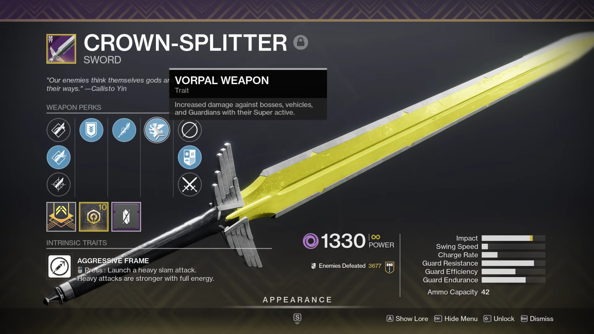 | 
| Swords should be used with three light hits and one heavy attack. | **Note**: `The Lament` requires the user to guard briefly before use. |

#### :yellow_square: Scanner

#### :red_square: Operator

#### :calendar: Challenge

### Parkour

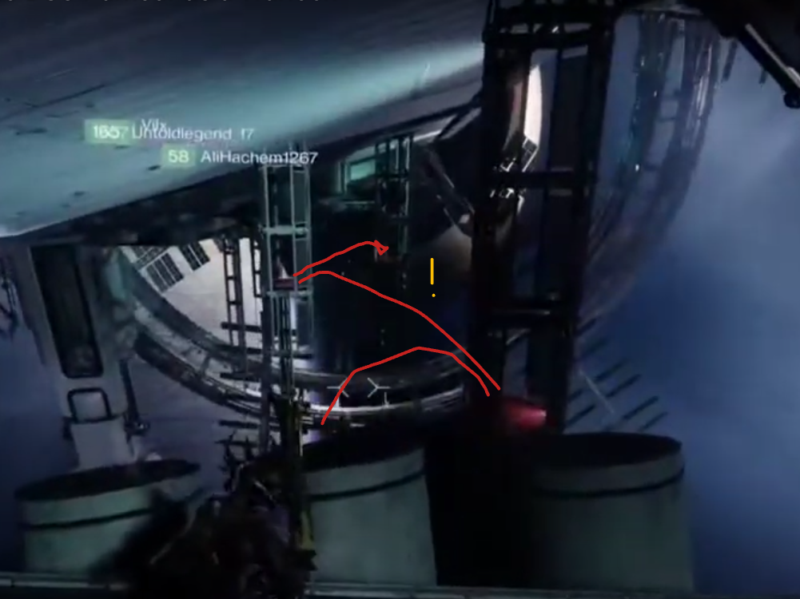

#### :information_source: Outline

The parkour section is relatively obvious in its structure. The easiest route is to stick to the right hand side of the station, then detour to collect the chest, rather than attempting the underside jump, especially with newbies in the mix. Understand my poor markup skills, I'm not a graphic designer.

#### :guard: Gear

---

### Rapture

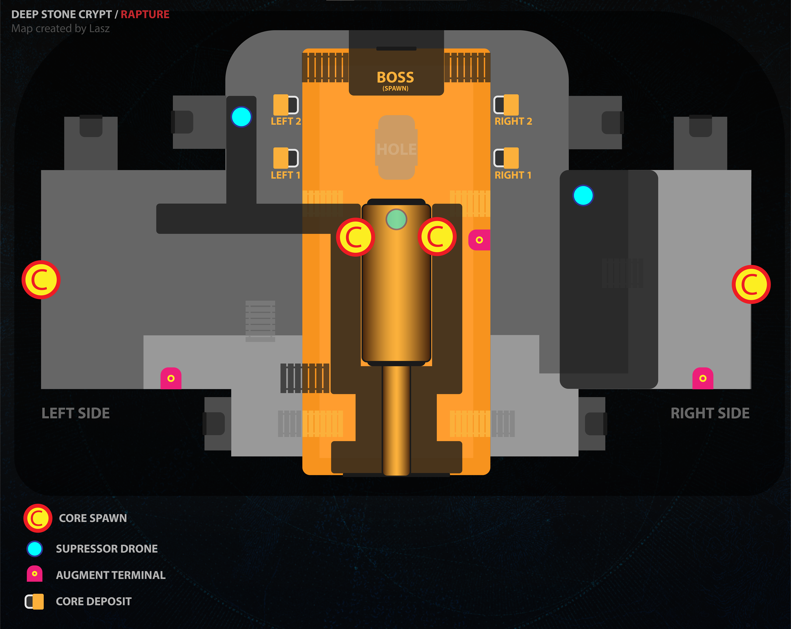

#### :information_source: Outline

The room is divided into three distinct sections: :arrow_left: Left, :arrow_down: Middle, :arrow_right: Right. Each contains an augmentation terminal. In :arrow_left: Left and :arrow_right: Right, there are four :radioactive: Core spawn locations.

This is deemed the easiest encounter on account of the fact that complexity is distributed across all players, rather than falling specifically on some select players. The recommended strategy for this is called Chaos.

The Chaos strat has three rules:

1. Don't pick up a buff you don't know.
2. Pick up :radioactive: Cores.
3. Clear adds effectively.

Please see :yellow_square: **Bin/Box Callouts**

To begin, either shoot Taniks at the back of the room, or step beyond the `L1` and `R1` :wastebasket: bins.

#### :guard: Gear

| | | |
|---|---|---|
| 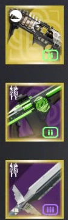 |  |  |

#### :yellow_square: Scanner

##### :wastebasket: Bin/Box Callouts

> For those on PlayStation, simply turn your controller so you can see your triggers. The :wastebasket: bins are arranged in an identical pattern, and are named as such.

There are four :radioactive: Core deposit points, called :wastebasket: bins, arranged around the :arrow_down: middle of the room.

| Map | | | | |
|---|---|---|---|---|
| | | Boss | | |
| | `L2` | | `R2` | |
| :radio_button: | `L1` | | `R1` | :radio_button: |
| | | :radio_button: | | |

#### :red_square: Operator

#### :blue_square: Supressor

#### :calendar: Challenge

---

### Taniks

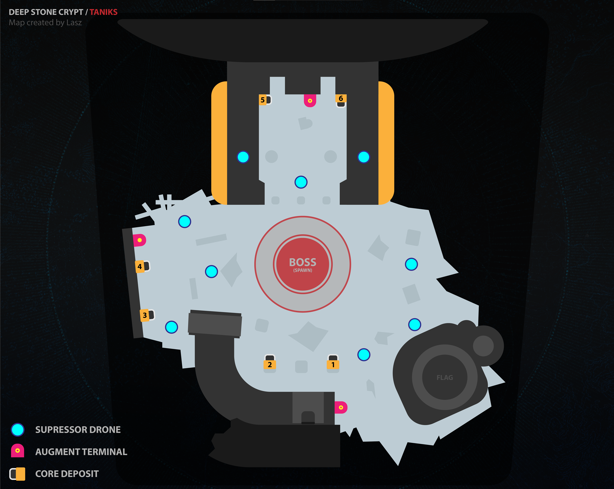

#### :information_source: Outline

#### :guard: Gear

#### :yellow_square: Scanner

#### :red_square: Operator

#### :blue_square: Supressor

#### :calendar: Challenge

---

## Secrets

---

## Side-Effects

### Worlds-First

### Individual

---

## Credits

| **source**                                    | **resource**               |
|-----------------------------------------------|----------------------------|
| [link](https://imgur.com/user/vargamatemedia) | Illustrated Encounter Maps |
| [link](https://www.niris.tv/blog/deep-stone-crypt-loot-table) | Loot Table |
| `iAthanasia` | **Atraks**: Kaboom? yes |
